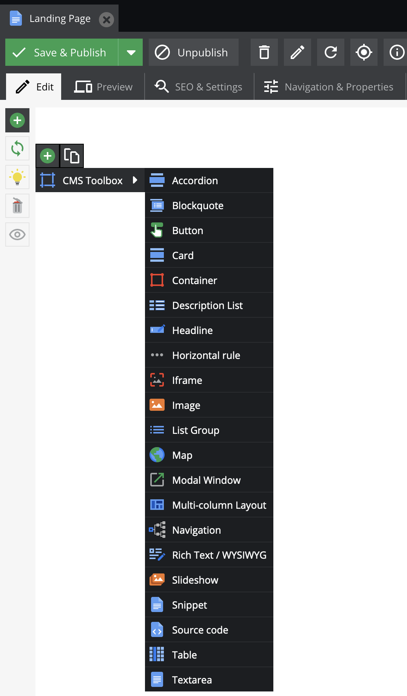

# CMS Toolbox

This bundle provides ready-to-be-used area bricks to create Pimcore documents without any programming effort. As many websites use the same basic components and only adjust their specific styling this bundle contains both: basic components with the ability to individually style and configure them. In the end you will have responsible documents which can be used for landing pages, Web2Print documents or complete websites.

## Usage

After installation you can immediately start to create documents:

Directly after creation the document offers to add all different types of area blocks:

After adding a `multi-column layout` and inside this an `image` field on the left and a `headline` and a `richtext` field on the right, the document looks like this:

On the frontend this document looks like this:

Every area brick has a configuration section, for instance in this example the grid has been adjusted to 3/12 and 9/12. 

With those configurations it is possible to individually customize every component to your needs, be it sizes, colors or even adding completely individual CSS rules.

## Available Areas

The following areas come with the toolbox and can be used without any additional
configuration (although configuration and modification is possible, if needed):

- **Multi-column layout**
  - This component allows you to define a layout with multiple columns. Within each column,
    you can place additional area bricks.
  - *Defining columns:*

    The setting window for this component shows a tab for every bootstrap
    breakpoint. The smallest, xs, determines which columns exist at all. For the
    other breakpoints, you can modify the size of each column.
  - *Inheritance:*

    Breakpoints inherit their settings from the breakpoints that come before
    them - `sm` inherits from `xs`, `md` inherits from `sm` etc. `xs` is the default
    setting and thus can not inherit settings. The other breakpoints have an
    `Inherit` checkbox, which is enabled by default, so all breakpoints
    initially inherit settings from xs. If you disable this checkbox, the column
    settings become modifiable. All larger breakpoints will now inherit the
    settings you specify here. For example, if you disable inheritance for
    the `md` breakpoint, the larger breakpoints `lg` and `xl` will then inherit
    the settings from `md`.
  - *Adding and removing columns and offsets:*

    The breakpoint `xs` determines which columns (and offsets) there are, so columns
    can only be added or removed there. Be careful when removing columns that
    had content before. If you save your document, that content is lost.

    There are two types. Actual columns, which can be filled with content, and
    offsets, which push the following columns to the right. Offsets can not be
    filled with content.
- **Headline**
  - Single line text with configurable h*-Tag
- **Image**
  - Single image with options for positioning, sizing, and style
- **Plain Text**
  - Multiline textfield without any styling options
- **Rich Text (WYSIWYG)**
  - Text editor which supports styling / formatting the text. The available features are configurable to prevent too "wild" styling

## Integration

### Combine with own area bricks / controllers / templates

You can also combine the area bricks of this bundle with your own area bricks and use them together in one document. Please see [Pimcore documentation](https://pimcore.com/docs/pimcore/current/Development_Documentation/Documents/Editables/Areablock/index.html#page_Integrate-an-Areablock-in-a-Template).

Please ensure that your template also includes those JS files (or integrate them into your build workflow):

- /bundles/cmstoolbox/webpack/app.js
- /bundles/cmstoolbox/webpack/common.css
- /bundles/cmstoolbox/webpack/editmode.css (only for editmode)

### Overriding the default views

All areas come with default bootstrap markup. If you need to change the
markup, you can override the view (template) of an area in your project. You
can then make modifications to the area in the new file.

You'll find all default views in `vendor/blackbit/cms-toolbox/src/Resources/views/Areas`.
Each area has its own folder. You can copy the whole folder with the
included `view.html.twig` to `app/Resources/BlackbitToolboxBundle/views/Areas` and modify the view according to your needs.
